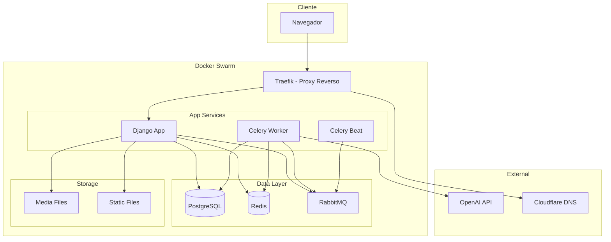
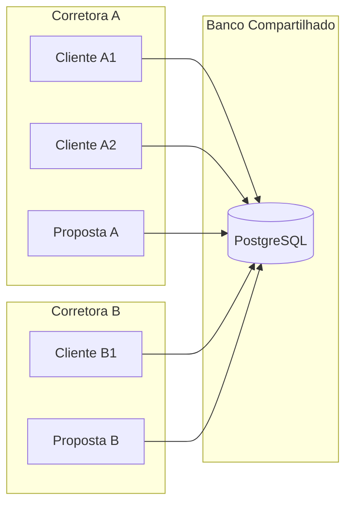

# Arquitetura

## Diagrama de Componentes



## Arquitetura Multi-Tenant



O sistema usa arquitetura multi-tenant compartilhada: banco e schema compartilhados, com separacao por campos-chave (`brokerage`), filtros, managers e middlewares.

### Componentes de Tenant

- `Brokerage` - Entidade tenant
- `User.brokerage` - FK para corretora
- `TenantMiddleware` - Define `request.brokerage`
- `TenantManager` / `TenantQuerySet` - Filtros padrao
- `BaseTenantModel` - Model abstrato com FK brokerage
- `TenantAdminMixin` - Filtro no admin Django

## Fluxo de Download Seguro

```mermaid
sequenceDiagram
    Usuario->>+App: GET /attachments/1/download/
    App->>+DB: SELECT * WHERE pk=1 AND brokerage=user.brokerage
    alt Encontrado
        DB-->>App: Attachment
        App-->>-Usuario: FileResponse (arquivo)
    else Nao encontrado
        DB-->>App: Vazio
        App-->>-Usuario: 404 Not Found
    end
```
