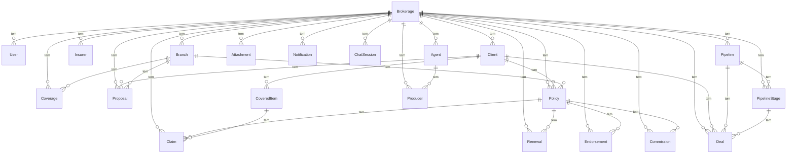

# Modelos

## Convencoes

- Todo modelo sensivel estende `BaseTenantModel` (possui FK `brokerage`)
- Todo modelo possui `created_at` e `updated_at`
- Managers usam `TenantManager` com `for_brokerage()` e `for_request()`

## Diagrama de Entidades

## Apps e Responsabilidades

| App | Modelos | Responsabilidade |
|---|---|---|
| `core` | Brokerage, User | Settings, auth, tenant middleware |
| `base` | - | Models base, mixins, managers |
| `accounts` | - | Onboarding, cadastro, landing |
| `clients` | Client | Clientes PF/PJ |
| `insurers` | Insurer, Branch, Coverage | Seguradoras, ramos, coberturas |
| `policies` | Proposal, Policy, CoveredItem, Endorsement | Propostas, apolices, endossos |
| `claims` | Claim | Sinistros |
| `renewals` | Renewal | Renovacoes |
| `crm` | Pipeline, PipelineStage, Deal | CRM, pipeline, kanban |
| `agents` | Agent, Producer | Agentes e produtores |
| `commissions` | Commission | Comissoes e repasses |
| `attachments` | Attachment | Anexos (GenericForeignKey) |
| `dashboard` | - | Dashboard com metricas |
| `reports` | - | Exportacao CSV |
| `ai` | Notification, ChatSession, ChatMessage | IA, resumos, chat, notificacoes |
